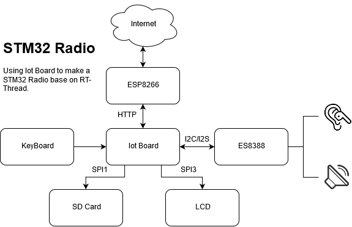

    Date           Author         Notes
    2019-08-27     WillianChan    first version

# Iot Board 网络收音机（播放器）制作方案

## 1. 设计方案

### 1.1 系统框架

基于 Iot Board 的网络收音机整体系统结构图如下：

### 1.2 硬件选型

网络收音机使用 Iot Board 制作，主控芯片是 STM32L475VET6，其主频为 80MHz，FLASH 为 512KB ，RAM 为 128KB。板载 TFTLCD 显示屏、高性能音频解码芯片、SD 卡卡槽、USB OTG Micro USB 接口、ATK MODULE 接口、独立按键等资源。

## 2. 设计思路

### 2.1. AUDIO

AUDIO 的解码是使用 Iot Board 板载的 ES8388 音频解码芯片，可对接 AUDIO 框架。板载还有一个耳机接口，可以插入耳机或者音响播放。

### 2.2. INTERNET

Iot Board 板载预留了 ATK MODULE 接口，可将 ESP8266 WIFI模块接在此接口。通过 WIFI 获取网络上的数据流。

### 2.3. FILE SYSTEM

由于网络收音机需要大容量 RAM 作为数据缓冲，而 Iot Board 片内 RAM 只有 128 KB，没有外扩SRAM，故因资源不足无法实现在线网络音频播放，目前改用先存储后播放的解决方案：

- SDCARD 挂载文件系统。
- 将获取到的网络音频数据信息保存到文件系统中。
- 再读取文件系统中的音频数据，通过 ES8388 解码播放。

~~除此之外，用户还可以通过 USB OTG Micro USB 接口连接 PC，通过 PC 可以访问 SDCARD 数据或者存放自己的音频在 SDCARD 中供网络收音机播放。~~

### 2.4. LCD

使用板载的 LCD 显示屏作为人机交互载体。可显示服务器信息、播放器控制界面、 SDCARD 中的文件信息、

### 2.5. KEYBOARD

控制向上/向下选择、暂停/恢复播放、开始/停止播放、增加/减少音量、切换页面、返回等操作。
